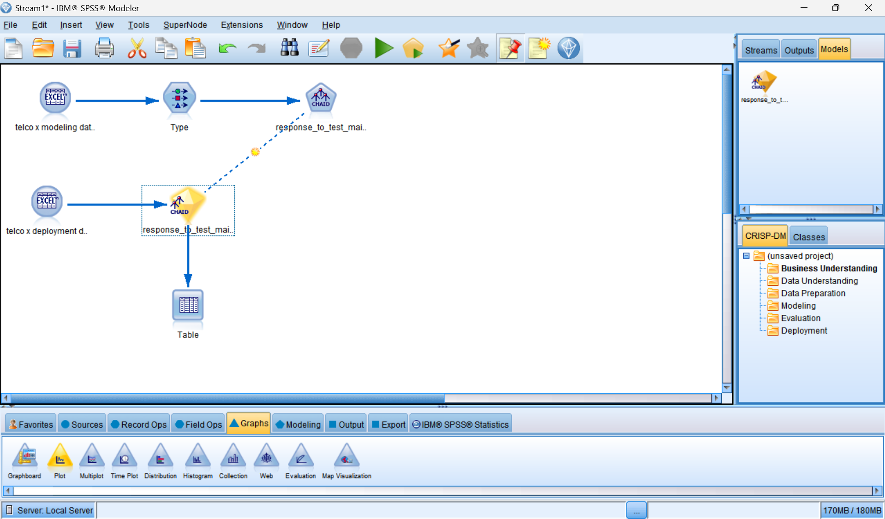
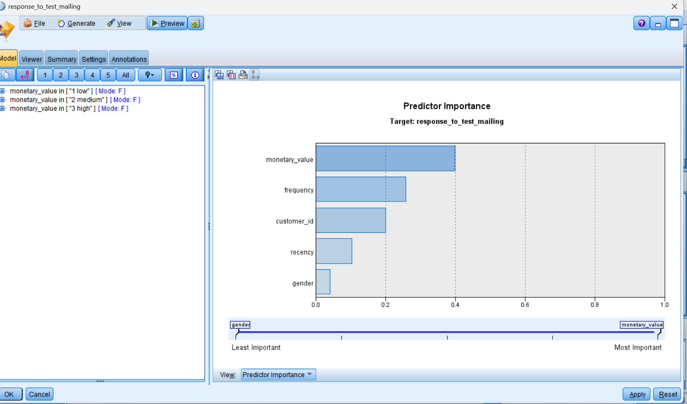
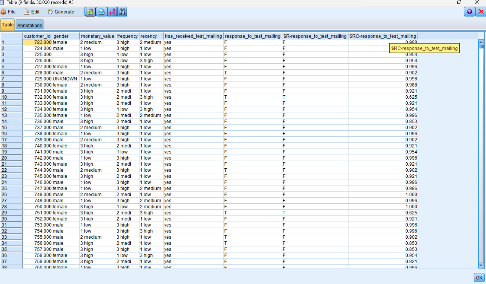

# 📊 Direct Marketing Campaign Response Prediction
**Tool:** IBM SPSS Modeler  
**Methodology:** Decision Tree (CHAID Algorithm)  

---

## Executive Summary
This project presents an end-to-end data science pipeline developed in IBM SPSS Modeler to predict customer responses to direct marketing campaigns. By analyzing demographic and Recency, Frequency, and Monetary (RFM) metrics, the CHAID model enables smart targeting—reducing marketing spend while maximizing conversion rates.

---

## 🛠️ Stream Architecture
The Modeler stream implements a robust dual-branch architecture separating training and deployment scoring pipelines to maintain clean inference.

---

## 🌳 Decision Tree Analysis & Business Insights
The Decision Tree segments customers into actionable behavioral clusters:

### Key Rules Extracted:
* **High Responders Segment:** Customers with high monetary spending and recent account engagement exhibit the highest response rate.
* **Low Responders Segment:** Customers with low frequency and low monetary value show negligible response rates.

---

## 📈 Model Deployment & Scoring Output
The model was applied to the unseen deployment dataset (`telco_x_deployment_data.xlsx`) to calculate categorical predictions and confidence metrics.

### Model Output Fields:
* **`$R-response_to_test_mailing`**: Predicted response class (`T` = True / Responds, `F` = False / No Response).
* **`$RC-response_to_test_mailing`**: Associated confidence score assigned by the CHAID model.

---

## 💡 Strategic Business ROI Recommendations
1. **Targeted Direct Mailings:** Restrict campaign mailings strictly to customers predicted as `$R = T` with confidence scores `$RC >= 0.65`.
2. **Cost Optimization:** Suppressing non-responders saves up to **60%** of printing and postage expenses without sacrificing sales leads.
